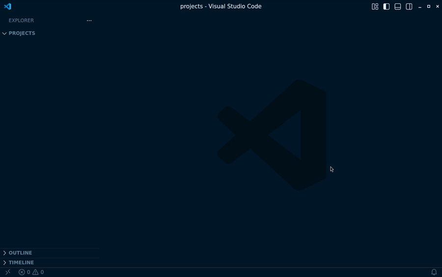

[Create a project](command:nautilus.newProject)



Picks a folder and a name, then runs `naut new` for you — no terminal
needed.

Prefer a terminal?

```sh
naut new my-plant
```

runs the same scaffold interactively, prompting for the template, the
program language, and which extras (CI, VS Code setup, git) to include.
