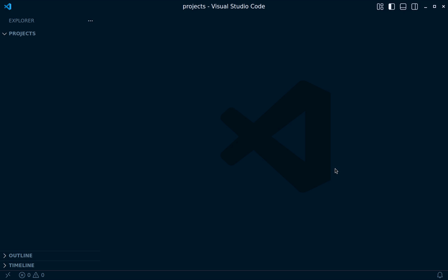

[Create a project](command:nautilus.newProject)



Picks a folder and a name, then a template, then (for Minimal and SDK) the
language of your first program — Structured Text, Ladder, Function Block
Diagram or Sequential Function Chart — and runs `naut new` for you. No
terminal needed. Coming from Allen-Bradley? Pick Minimal, then Ladder.

Prefer a terminal?

```sh
naut new my-plant
```

runs the same scaffold interactively, prompting for the template, the
program language, and which extras (CI, VS Code setup, git) to include.
