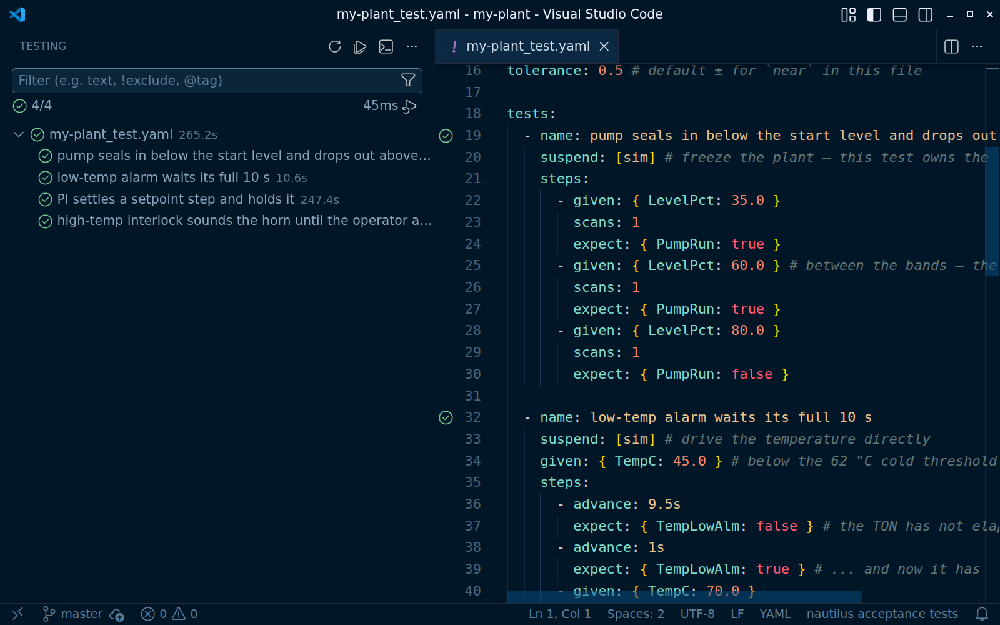

```sh
naut test
```

The Demo template ships one acceptance suite already passing. Click ▷ next
to any test in the **Testing** view to run just it — a failure shows the
exact step and tag value that broke, inline on the assertion.
