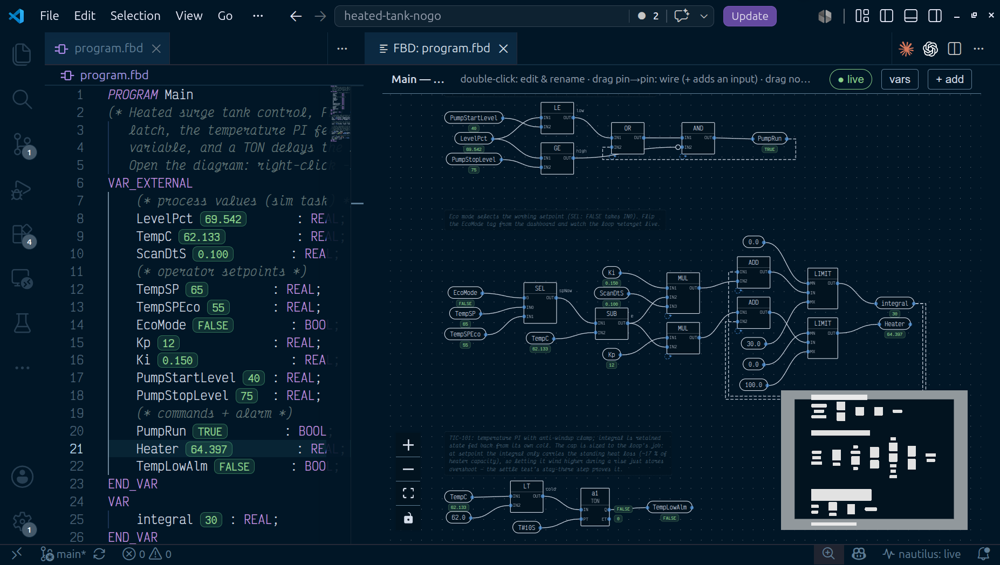

import Clip from '../../../components/Clip.astro';

An FBD program is a text file. `.fbd` source is a netlist of named wires
driven by blocks, coils that write variables, and function-block instances,
all inside an otherwise ordinary ST POU. The VS Code extension projects that
netlist into the diagram a controls engineer expects, and an edit made on the
diagram is written back into that same file as text. Values flow left to right
through blocks, which is what makes FBD fit continuous control: PI loops,
filters and scaling, selection and limiting, signal conditioning in stages.

## When to use it

Reach for FBD when the logic is mostly analog. A temperature loop with an
anti-windup clamp, a rate-of-change calculation, a rolling average, a
setpoint selector: these read as a chain of blocks, and the diagram shows
the chain.

Interlock logic that is almost entirely contacts and coils reads better as
[ladder](/languages/ladder/). A step sequence with holds and aborts belongs
in [SFC](/languages/sfc/). Anything needing branching, loops, or `CASE` is
[Structured Text](/languages/structured-text/) work; the netlist has no
control flow. Tasks can mix languages, one program file each, so a project
usually uses more than one.

## A netlist, line by line

This is `examples/lift-station/level.fbd`, complete:

```iecfbd
PROGRAM LevelControl
(* LIC-101: wet-well level to pump speed, plus the high level alarm
   seal-in. Open the diagram: right-click -> "Open With -> FBD Diagram". *)
VAR_EXTERNAL
    LIT101_Level   : REAL;
    LevelSP        : REAL;
    Kp             : REAL;
    Ki             : REAL;
    Kd             : REAL;
    MinSpeedHz     : REAL;
    MaxSpeedHz     : REAL;
    LevelDtS       : REAL;
    LeadReq        : BOOL;
    SpeedRef       : REAL;
    HandSpeedHz    : REAL;
    HighLevelAlmSP : REAL;
    HighLevelAlm   : BOOL;

    P101_RunCmd   : BOOL;
    P101_InHand   : BOOL;
    P101_SpeedCmd : REAL;
    P102_RunCmd   : BOOL;
    P102_InHand   : BOOL;
    P102_SpeedCmd : REAL;
END_VAR
FBD
  // LIC-101: level -> speed. AUTO free-wheels (CV tracks CV_MAN, bumpless
  // on return) whenever no pump is called — LeadReq false parks the loop
  // instead of integrating error for a pump that isn't running. Direct
  // acting: level above setpoint calls for MORE speed.
  lic : PID(AUTO := LeadReq, PV := LIT101_Level, SP := LevelSP,
            KP := Kp, KI := Ki, KD := Kd,
            CV_MIN := MinSpeedHz, CV_MAX := MaxSpeedHz,
            DIRECT := TRUE, DT := LevelDtS)
  SpeedRef := lic.CV

  // Per-pump speed command: stopped -> 0 Hz; running in Auto -> the loop's
  // output; running in Hand -> the operator's hand-speed setpoint.
  P101_SpeedCmd := SEL(P101_RunCmd, 0.0, SEL(P101_InHand, SpeedRef, HandSpeedHz))
  P102_SpeedCmd := SEL(P102_RunCmd, 0.0, SEL(P102_InHand, SpeedRef, HandSpeedHz))

  // LAH-101: seal-in with hysteresis — latches at HighLevelAlmSP, clears
  // 5 % below it, so a level sitting right on the setpoint doesn't chatter
  // the alarm on and off every scan.
  above = GE(LIT101_Level, HighLevelAlmSP)
  below = LE(LIT101_Level, SUB(HighLevelAlmSP, 5.0))
  HighLevelAlm := AND(OR(above, HighLevelAlm), NOT below)
END_FBD
END_PROGRAM
```

Everything before `FBD` and after `END_FBD` is plain ST: the POU header and
its `VAR` sections, compiled by the same front end as a `.st` file. The body
accepts these forms.

| Element | Written as | What it is |
| --- | --- | --- |
| Wire | `above = GE(LIT101_Level, HighLevelAlmSP)` | a named block output, defined once |
| Coil | `SpeedRef := lic.CV` | writes a variable; the target may be an array element or struct member, as in `TempHist[1] := TempC` |
| FB instance | `lic : PID(AUTO := LeadReq, PV := LIT101_Level, ...)` | declares the instance and calls it in one statement; `lic : PID` alone declares it, `lic(PV := ...)` calls it later |
| Pin read | `lic.CV` | an output pin of an FB instance |
| Output binding | `ET => Elapsed` | IEC's formal-call output form, for capturing a non-BOOL pin such as `ET` or `CV` into a variable |
| Negation | `NOT high` | inline pin negation, drawn as the IEC circle on the pin |
| Constant | `5.0`, `T#10S`, `TRUE`, `'ok'` | a literal input chip |
| Accessor | `TempHist[2]`, `M.Speed` | array element or struct member, as an input or a coil target |
| Network | `NETWORK 'high-level alarm'` | starts the next numbered network; the title is optional ([below](#networks)) |
| EN / ENO | `sp = LIMIT(EN := Run, MN := 0.0, IN := x, MX := 9.0, ENO => ok)`, `t1.ENO` | execution control on any block ([below](#eneno-execution-control)) |

Full-line `//` comments inside the body render as notes on the diagram.
Statements may end with `;` or just a newline. A standard function's inputs
are positional, `LIMIT(0.0, x, 9.0)`, or all named by their standard names,
`LIMIT(MN := 0.0, IN := x, MX := 9.0)`.

## How a diagram evaluates

Compilation transpiles the netlist to equivalent ST and runs it through the
ST front end, so FBD inherits the whole type system, the standard library,
and the diagnostics. Errors map back to the exact `.fbd` line.

Wires are pure combinational expressions. A wire is inlined at every place
it is read, so fan-out duplicates an expression rather than creating shared
state, and wires must be acyclic: a wire that reads itself, directly or
through another wire, is a compile error ("combinational loop through wire").

Variables carry state. That is where feedback lives. `HighLevelAlm :=
AND(OR(above, HighLevelAlm), NOT below)` reads the same variable the coil
writes, which is a seal-in latch and evaluates exactly as a PLC evaluates
one. The same mechanism is what a shift register or any other "read early
in the body, write later" pattern rests on: a variable read early in the
body carries the value its coil wrote on the previous scan.

Statements evaluate in source order, with one adjustment: a function-block
call is emitted ahead of any statement that reads its output pins, so
`lic.CV` reads this scan's result no matter where `lic` sits in the file.
Ties keep source order. With [networks](#networks), that rule applies within
each network and the networks run in order. There is no other reordering
and no way to override it.

### Networks

A body can be divided into numbered networks, the way TIA Portal and CODESYS
lay out an FBD block. A `NETWORK` line starts one, with an optional title,
and it runs to the next:

```iecfbd
FBD
  NETWORK 'LIC-101: level to pump speed'
  lic : PID(AUTO := LeadReq, PV := LIT101_Level, SP := LevelSP, DT := LevelDtS)
  SpeedRef := lic.CV
  NETWORK 'LAH-101: high level alarm'
  // latches at the setpoint, clears 5 % below it
  above = GE(LIT101_Level, HighLevelAlmSP)
  below = LE(LIT101_Level, SUB(HighLevelAlmSP, 5.0))
  HighLevelAlm := AND(OR(above, HighLevelAlm), NOT below)
END_FBD
```

Network 1 runs to completion, then network 2. Within a network the
FB-before-reader rule holds; a read of a later network's FB output sees the
previous scan's value. The numbers are positions: the file holds only the
order, so moving or inserting a network renumbers nothing in the text.
Statements before the first `NETWORK` line are an untitled first network,
and a body with no `NETWORK` line is one network, exactly as before.

### EN/ENO: execution control

Any block takes `EN` (BOOL, TRUE when unbound) and gives `ENO`, as IEC
61131-3 defines them. While `EN` is FALSE the block does not run: a
function's result is not written, so the variable it drives keeps its
value, and a function block's outputs and internal state hold. `ENO` is
`EN` AND no error; `DIV` and `MOD` report a zero divisor through it. A
block with EN/ENO must drive a variable (a coil, directly or through its
named wire), and its `ENO` reads like a pin: `t1.ENO`, or `sp.ENO` for a
block on wire `sp`, can feed a coil or the next block's `EN`. The details,
and the ST form, are in the [language reference](/reference/functions/#eneno-execution-control).

## Types, functions, and blocks

FBD uses the same vocabulary as Structured Text. `AND`, `OR`, `XOR`, `ADD`
and `MUL` take two or more inputs (the `+` pin in the editor adds one);
`SUB`, `DIV`, `MOD` and the comparisons take exactly two; `MOVE` is a
one-input pass-through for wiring. Standard functions such as `LIMIT`, `SEL`,
`SQRT` and `CONCAT` are written as blocks with positional inputs, and
standard function blocks such as `TON`, `CTU` and `R_TRIG` are instantiated
with named pins. An FB input left out of the call keeps its value (its
declared initial value until something writes it). User-defined `TYPE`
structs work as inputs and coil targets.
The whole list is in the [language reference](/reference/functions/).

A `FUNCTION_BLOCK` you write yourself instantiates the same way a `TON` does:

```iecfbd
  r1 : RateOfChange(IN := TempC, DT := RepDtS)
  TempRate := r1.OUT
```

`RateOfChange` is authored in an ST library file and composed ahead of the
program, the same way `examples/lift-station/lib/pump.st`'s `RuntimeMeter`
is. A `FUNCTION_BLOCK` can carry an FBD body as well, or even a ladder one —
`examples/lift-station/lib/motor.ld`'s `MotorStarter` is authored as rungs
and instantiated once per pump — because a `.fbd`/`.ld`/`.st` file with no
`PROGRAM` is a project library, and its blocks instantiate from any
language. Write a block once, call it from whichever language fits the
logic. See [function blocks, libraries, and
tasks](/guides/blocks-and-tasks/).

## In the editor



Right-click a `.fbd` file and choose **Open With → FBD Diagram** to use the
diagram as the editor itself, or run **nautilus: Open FBD Diagram Preview**
to open it beside the text, which then updates as you type. With a `.fbd`
open as text, the editor title's **Open as Diagram Editor** button swaps the
tab for the diagram and carries unsaved edits across; from the diagram,
**Show Source** opens the text beside it.

<Clip id="04-title-buttons" />

Structural gestures are resolved by the Go compiler into minimal text edits
against the file: double-click a constant to retype it or a block to rename
it, click an input pin to toggle `NOT`, drag an output onto a pin to rewire,
and delete a selected node.

<Clip id="fbd_wire" />

The **+ add** palette inserts statements: networks, block-to-wire (its
function field offers the project's own `FUNCTION`s by name, beside the
standard ones), function blocks from the picker (every required input an
open `_` pin; an input with a declared default stays unbound), coil, timer,
counter, comment, bare reference chips, and variable declarations.

Each network draws as a numbered band with its title, and every statement
carries a small badge with its execution order in the network. Click a
band's header and **+ add** inserts into that network; its ▲ ▼ buttons move
the network, + adds one after it, ✕ removes the `NETWORK` line (the
statements join the network above), and a double-click renames it.
`EN`/`ENO` pins draw when they are bound; the small **EN** toggle on a block
shows them as open pins to wire.

<Clip id="fbd_add_block" />

Layout is computed from topology by default. Drag a node to pin it and the
position is stored in a `(* @layout *)` comment that the compiler skips,
right after `END_FBD` so it never sits between statements; **auto layout**
clears every pin.

<Clip id="fbd_move_node" />

The **vars** button opens a panel listing every header declaration, wired or
not, with its section, its live value, an `unused` marker when nothing in the
logic references it, and an amber **no tag** badge on a `VAR_EXTERNAL` with
no matching tag on the controller. A read of a tag that was never written
faults the scan, so clear that badge before you download.

With a controller reachable, live values paint onto the diagram: value pills
on variable chips and on FB output pins, alongside the inline values in the
text editor.

**nautilus: Diff FBD Diagram (vs git HEAD)** overlays the committed and
working-tree diagrams, coloring added, removed and changed blocks and wires.
`(vs Controller)` compares against the program a live controller is running.
`(between git revisions…)` picks any two commits from the file's history, or
one commit and the working tree, and overlays those.

## Tooling

```sh
naut check              # compile .fbd (and .st/.ld/.sfc); the CI gate
naut test               # acceptance tests, virtual clock
naut fbd graph f.fbd    # the diagram render model as JSON
naut fbd edit           # apply one structural edit op; stdin/stdout JSON
```

A controller running an FBD program serves and accepts the `.fbd` text
itself, so download, text diff, `naut pull` and the sync status bar work
as they do for `.st`. A warm swap migrates retained state by name and type,
so a PID's integral or a running `TON` keeps its value through the edit; see
[online edits](/guides/online-edits/). An edit routes to a task by `PROGRAM`
name, so a task's own `.fbd` downloads without disturbing another task's
program running alongside it.

Because the source is text, a wiring change reviews as a diff:

```diff
-  above = GE(LIT101_Level, HighLevelAlmSP)
+  above = GE(LIT101_Level, SUB(HighLevelAlmSP, 2.0))
```

## Not supported

- Authoring a `FUNCTION` in FBD. Functions are ST; blocks may be FBD or
  ladder.
- Execution-order overrides. Order is network order, then source order plus
  the FB-before-reader rule within a network.
- Control flow: no `IF`, `CASE`, or loops in the netlist.
- Inline arithmetic in an array index. Compute the index on a named wire
  first, then use `Levels[i]`.
- Defining the same wire twice, or a wire that feeds itself. Both are
  compile errors.

## See also

- [Language reference](/reference/functions/) — evaluation semantics and
  every built-in operator, function, and function block.
- [Function blocks, libraries, and tasks](/guides/blocks-and-tasks/)
- [The tag model](/guides/tag-model/)
- [Online edits](/guides/online-edits/)
- [Testing](/reference/testing/)
- [Structured Text](/languages/structured-text/),
  [Ladder](/languages/ladder/),
  [Sequential Function Chart](/languages/sfc/)
