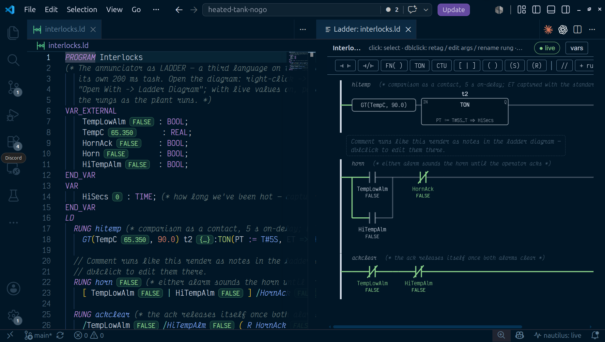

IEC 61131-3 defines ladder graphically. nautilus defines it as text: a `.ld`
file holds rungs written left to right along the power rail, in a grammar
with the standard's semantics and no vendor dialect. The VS Code extension
projects that text into a ladder editor where every gesture writes back to
the same file.

## When to use it

Ladder fits boolean logic that gets reviewed by asking which contacts passed
power: interlocks, permissives, latches, motor seal-ins, annunciators and
alarm horns. It is the language most control engineers read fastest, and one
rung is one line of `git diff`.

Loops and signal conditioning read better as [Function Block
Diagram](/languages/function-block/). Math, arrays, and plant physics belong
in [Structured Text](/languages/structured-text/). Mix them per task against
one tag store.

## A rung, in text

A trimmed slice of `examples/lift-station/permissives.ld` — the duty
mapping and one pump's permissive/start rungs; `P102`'s mirror the same
shape:

```iecld
PROGRAM Permissives
VAR_EXTERNAL
    LeadIsP101 : BOOL;  LeadReq : BOOL;  LSHH101 : BOOL;  LSLL101 : BOOL;
    P101_Req        : BOOL;
    P101_SealFail   : BOOL;  P101_OverTemp : BOOL;  P101_VfdFault : BOOL;
    P101_Permissive : BOOL;
    P101_Mode       : INT;   P101_Running  : BOOL;
    P101_RunCmd     : BOOL;  P101_FailToRun: BOOL;  P101_LockedOut: BOOL;
    P101_Avail      : BOOL;  ResetFaults   : BOOL;
END_VAR
VAR
    m101 : MotorStarter;
END_VAR
LD
  // duty mapping + high-high override, one rung: LSHH forces the call
  // regardless of the sequence or who's lead
  RUNG p101req
    [ LeadIsP101 LeadReq | LSHH101 ] ( P101_Req )

  RUNG p101perm (* a dry well (LSLL) blocks both pumps, not just the lead *)
    /P101_SealFail /P101_OverTemp /P101_VfdFault /LSLL101 ( P101_Permissive )

  // every BOOL input bound by name: no free input for rung power, so the
  // call sits alone on the rail — see docs/functions.md "Power pins in ladder"
  RUNG p101start
    m101:MotorStarter(Mode := P101_Mode, AutoReq := P101_Req, Permissive := P101_Permissive,
                       RunFb := P101_Running, Reset := ResetFaults,
                       Run => P101_RunCmd, FailToRun => P101_FailToRun,
                       LockedOut => P101_LockedOut)

  RUNG p101avail (* Off (Mode 0) is never available, same as a failed, locked-out, or blocked pump *)
    /P101_FailToRun /P101_LockedOut P101_Permissive /EQ(P101_Mode, 0) ( P101_Avail )
END_LD
END_PROGRAM
```

Every element the grammar accepts:

| Element | Text | What it does |
| --- | --- | --- |
| NO contact | `Tag` | passes power when `Tag` is TRUE |
| NC contact | `/Tag` | passes power when `Tag` is FALSE |
| Rising-edge contact | `+Tag` | one scan of power on `Tag`'s 0→1 transition (an implicit `R_TRIG`) |
| Falling-edge contact | `-Tag` | one scan of power on `Tag`'s 1→0 transition (an implicit `F_TRIG`) |
| Parallel branch | `[ a \| b ]` | OR of its legs; each leg is a series, and branches nest |
| Function contact | `EQ(P101_Mode, 0)` | passes power when the call returns TRUE |
| Negated function contact | `/EQ(P101_Mode, 0)` | passes power when the call returns FALSE; `/` negates any BOOL term, `/t1.Q` included |
| Block in the rung | `m101:MotorStarter(Mode := P101_Mode, …)` | power drives its power-in pin, and continues from its power-out pin |
| Output capture | `Run => P101_RunCmd` | binds an output pin to a variable, inside the block's parentheses; the standard's own `=>` form, for a BOOL pin exactly as for a timer's elapsed time |
| Output coil | `( Tag )` | `Tag :=` the rung condition, every scan |
| Set coil | `( S Tag )` | latch: `Tag := Tag OR condition` |
| Reset coil | `( R Tag )` | unlatch: `Tag := Tag AND NOT condition` |
| Rising-edge coil | `( P Tag )` | `Tag` is TRUE for one scan when the rung condition rises |
| Falling-edge coil | `( N Tag )` | `Tag` is TRUE for one scan when the rung condition falls |

Contacts and coils take the same accessor references FBD takes, so array
elements and struct members address directly: `Levels[2]`, `PIT_001.VALUE`.
A rung header carries a `(* … *)` comment; full-line `//` comments inside
the block are diagram notes.

## How a rung evaluates

Series elements AND together and branch legs OR, so
`[ Start | Run ] /Stop ( Run )` compiles to
`Run := AND(OR(Start, Run), NOT Stop)`. That is the seal-in: Start energizes
Run, Run's own contact holds it in, Stop drops it out.

Coils sit at the right end of a rung. A rung needs at least one coil or a
function block as its last element: `A B t1:TON(PT := T#5S)` is a complete
rung whose only output is `t1.Q`, read elsewhere. Several coils share one
condition, evaluated once and fanned out. A rung with only a coil is driven
by the rail, so `( AlwaysOn )` assigns TRUE. Rungs evaluate
top to bottom within a scan, so a coil written on one rung reads back as a
contact on the next rung in the same scan.

Power is boolean, so anything gating it has to return BOOL. The six
comparisons do. Numeric functions do not, and `ADD(TempC, 0.0)` as a contact
is a compile error rather than a pass-through; numeric work goes inside a
comparison's arguments, as `GE(ADD(Base, Bias), Limit)`.

When a block sits in a rung, power drives one input pin and leaves from one
output pin; every other pin is named in the parentheses. `TON`, `TOF` and
`TP` use `IN` and `Q`, `CTU` uses `CU`, `CTD` uses `CD`, `R_TRIG` and
`F_TRIG` use `CLK`, `SR` uses `S1`/`Q1`, `RS` uses `S`/`Q1`. Passing the
power pin yourself (`t1:TON(IN := x)`) is an error, because power owns it.

Coils assign BOOL only. To store a timer's elapsed time or a counter's
value, use the standard's output binding at the call site, `Run =>
P101_RunCmd` above. Any instance output is also readable as `inst.Pin`
anywhere, including as a contact: `m101.FailToRun` reads the same way a
plain BOOL tag would, without needing a `=>` capture first.

Edge contacts and edge coils are unnamed in the text. The compiler derives
a stable instance name from the rung name, the tag, and the position among
repeats in that rung, so the edge's retained state survives an unrelated
edit elsewhere in the program.

## Types, functions, and blocks

LD transpiles in one hop to the FBD netlist, which transpiles to ST. Ladder
inherits the whole chain rather than reimplementing it: the built-in
operator, function and function-block vocabulary, user `FUNCTION`s and
`FUNCTION_BLOCK`s from library `.st` files, arrays and structs through
accessor references, and typed diagnostics mapped back to the rung.

A user block drops into a rung the way a TON does. Power lands on `EN` if
the block declares one, otherwise on the first BOOL `VAR_INPUT` the call
does not bind by name, and continues from `ENO` or the first BOOL
`VAR_OUTPUT`. Every other pin is bound in the parentheses, with `=>`
capturing outputs. Instance state persists across scans, and an online edit
carries it by name and type.

Blocks can be written in ladder, too. A `.ld` file may hold
`FUNCTION_BLOCK`s whose bodies are rungs, and a `.ld` file with no
`PROGRAM` is a project library, the same rule that makes a PROGRAM-less
`.st` one:

```iecld
FUNCTION_BLOCK MotorStarter
VAR_INPUT
    Mode       : INT;  (* 0 Off, 1 Hand, 2 Auto *)
    AutoReq    : BOOL;
    Permissive : BOOL;
    RunFb      : BOOL;
    Reset      : BOOL;
END_VAR
VAR_OUTPUT
    Run       : BOOL;
    FailToRun : BOOL;
END_VAR
VAR t1 : TON; END_VAR
LD
  RUNG run
    [ EQ(Mode, 2) AutoReq | EQ(Mode, 1) ] Permissive /FailToRun ( Run )
  RUNG fail
    Run /RunFb t1:TON(PT := T#5S) ( S FailToRun )
  RUNG reset
    Reset ( R FailToRun )
END_LD
END_FUNCTION_BLOCK
```

This is what ladder has instead of a JSR: a subroutine with pins rather
than shared tags, and retained state per instance. Two pumps are two
instances of one block, each with its own seal-in and its own `t1`. The
`VAR_*` sections are ordinary POU declarations, `VAR_IN_OUT` included, so
a ladder block can take a UDT by reference. `examples/lift-station/lib/motor.ld`
is the whole feature (this listing trims its lockout counter) —
instantiated twice, once per pump, from `permissives.ld` above. See
[Function blocks, libraries, and tasks](/guides/blocks-and-tasks/).

## In the editor



Right-click a `.ld` file and choose **Open With → Ladder Diagram** to use
the diagram as the editor, or run **nautilus: Open Ladder Diagram Preview**
for text on the left and rungs on the right. Layout is canonical, computed
from the source, so no coordinates land in your diffs. Editing gestures
resolve through the Go compiler into minimal text edits:

- A palette of NO contact, NC contact, function contact, TON, CTU, parallel
  branch, and output/set/reset coil. Click to append at the selection, or
  drag onto a rung.
- Double-click a contact or coil to retag it, a function contact to rewrite
  the call, a block to edit its arguments, the rung name to rename it, and
  the `(* … *)` slot to write a rung comment.
- `N` flips a contact between NO and NC, `M` cycles a coil through output,
  set and reset, `B` wraps the selection in a parallel branch, `Del`
  deletes, and Ctrl+X/C/V cut, copy and paste. A pasted block instance gets
  a fresh name.
- Drag an element to reorder it or move it to another rung. A contact
  dropped in the coil zone is refused, and so is a coil dropped mid-series.
- `+ rung` adds a rung, `//` adds a comment note, and the variables panel
  declares or removes a declaration without leaving the diagram.

With a controller reachable, live values paint power flow: contacts and
coils show their state, the wires show whether power reaches that far, and
comparisons evaluate locally. An in-rung block reads its real output pin
from the controller. Anything unresolvable renders neutral.

**nautilus: Diff Ladder Diagram (vs git HEAD)** and **(vs Controller)**
overlay the committed or running rungs on the working ones, marking added,
changed and removed elements in cyan, amber and red. Green already means
power here. **(between git revisions…)** lists every commit that touched
the file and overlays any two of them the same way, so the change between
last month's program and today's, or between any two releases, reads as
rungs. Pick the working tree as the newer side and the overlay follows your
edits. The git diffs work on a Rockwell `.L5X` export as well.

## Tooling

```sh
naut check                      # compile every .st/.fbd/.ld/.sfc; errors land on the rung
naut test                       # acceptance tests, on the virtual clock
naut ld graph permissives.ld    # the ladder render model as JSON
naut ld edit                    # apply one structural edit op, from JSON on stdin
```

`naut check` composes the line maps back through both hops, so a type
error in the ST a rung produced reports at that rung's `RUNG` line. The
language server does the same live.

Online edits treat `.ld` as the program source. Download, diff against the
controller, and `naut pull` all move the ladder text itself, so the
program a controller reports compares 1:1 with the file in git. See [Online
edits](/guides/online-edits/).

A rung change reviews as a rung:

```diff
   RUNG p101req
-    [ LeadIsP101 LeadReq | LSHH101 ] ( P101_Req )
+    [ LeadIsP101 LeadReq | LSHH101 | ManualCall ] ( P101_Req )
```

`naut new my-plant --template minimal --language ld` scaffolds a project
whose program is ladder.

## Not supported

- **Jumps and labels.** No `JMP`, `JMPC`, `LBL`, `RET`. Rungs run top to
  bottom, every scan.
- **Master control relay zones.** No `MCR` or zone bracketing.
- **Negated coils.** `( /Tag )` is rejected; invert with NC contacts or use
  a reset coil.
- **Coils inside a branch, or ahead of a later block.** The output zone is
  contiguous at the rung's right end. Split such a rung into one rung per
  output leg.
- **Vendor instruction sets.** The vocabulary is the IEC built-ins in the
  [language reference](/reference/functions/), and nothing else.

## See also

- [Language reference](/reference/functions/) — power flow, power pins, and
  every built-in.
- [Function blocks, libraries, and tasks](/guides/blocks-and-tasks/)
- [Online edits](/guides/online-edits/)
- [Testing](/reference/testing/)
- [Structured Text](/languages/structured-text/) ·
  [Function Block Diagram](/languages/function-block/) ·
  [Sequential Function Chart](/languages/sfc/)
