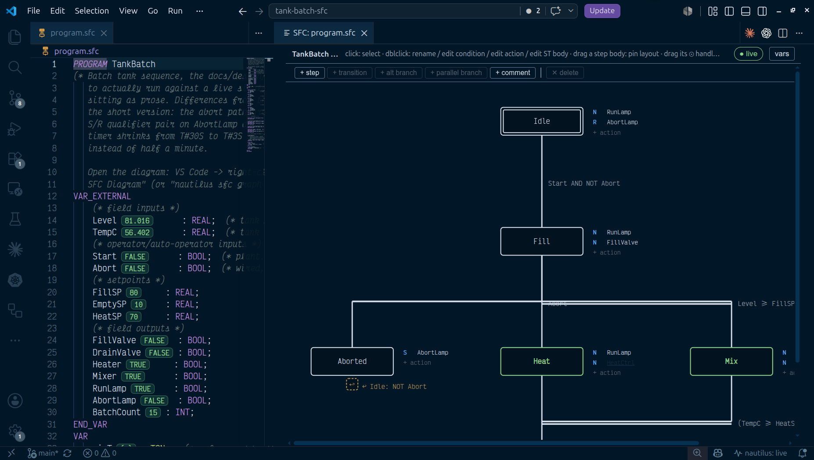

An SFC program is a `.sfc` file: an ST POU whose body is an `SFC … END_SFC`
block written with IEC 61131-3's own keywords, `INITIAL_STEP`, `STEP`,
`TRANSITION`, and `ACTION`. The text is the program, and the VS Code
extension projects it into the classic chart view where every gesture is a
structural edit to that text.

## When to use it

Reach for SFC when the process has phases: batch sequences, startup and
shutdown, state machines that would otherwise be a pile of latches. A step is
a state, a transition is the condition that ends it, and actions drive
outputs while a step is active, so the chart reads as the sequence of
operations the process engineer wrote down. Continuous control belongs in
[FBD](/languages/function-block/), interlocks in
[ladder](/languages/ladder/), and algorithms in
[ST](/languages/structured-text/).

## A chart, in text

`examples/batch-skid/phases.sfc`, trimmed of its CIP branch, its Hold/Resume
detour through `Held`, and its comments. It picks a recipe, charges two
dosing lines and runs the agitator simultaneously, converges once all three
are done, heats and holds at temperature, and transfers — with an abort
path off `Heat`.

```iecsfc
PROGRAM BatchSequence
VAR_EXTERNAL
    RecipeSel  : INT;  Start : BOOL;  Abort : BOOL;
    Active     : Recipe;  Batch : BatchStatus;
    TT201_Temp : REAL;
    XV201A_Cmd : BOOL;  XV201B_Cmd : BOOL;
    AgitateReq : BOOL;  HeatingActive : BOOL;  TransferReq : BOOL;
    IdleLamp   : BOOL;  AbortLamp : BOOL;  PhaseName : STRING;
    DoseTimeoutA : BOOL;
END_VAR
VAR
    recipes : RecipeTable;
    holdTmr : TON;
END_VAR
SFC

  INITIAL_STEP Idle:
    N  IdleLamp;
    R  AbortLamp;              (* clear the latch on return to Idle *)
    N  SetIdle;
  END_STEP

  STEP Prep:
    P  LoadRecipe;              (* plain P — the same edge as P1 *)
    N  SetPrep;
  END_STEP

  STEP ChargeA:
    N  XV201A_Cmd;
    N  CheckDoseATimeout;       (* ACTION block, below *)
    N  SetCharging;
  END_STEP

  STEP ChargeB:
    N  XV201B_Cmd;
    N  SetCharging;
  END_STEP

  STEP Agitate:
    N  AgitateReq;
    N  SetCharging;
  END_STEP

  STEP ChargeADone: END_STEP
  STEP ChargeBDone: END_STEP

  STEP Heat:
    N  HeatingActive;
    N  AgitateReq;
    N  SetHeat;
  END_STEP

  STEP Hold:
    N  HeatingActive;
    N  HoldTmr;                 (* ACTION: holdTmr(IN := Hold.X, PT := ...) *)
    N  SetHold;
  END_STEP

  STEP Transfer:
    N  TransferReq;
    N  SetTransfer;
  END_STEP

  STEP Aborted:
    S  AbortLamp;              (* latched until Idle resets it *)
    N  SetAborted;
  END_STEP

  TRANSITION t_start FROM Idle TO Prep := Start AND RecipeValid(RecipeSel);
  END_TRANSITION

  (* simultaneous divergence: charge both lines and agitate together *)
  TRANSITION t_prep FROM Prep TO (ChargeA, ChargeB, Agitate) := TRUE;
  END_TRANSITION

  TRANSITION t_abort_a FROM ChargeA TO Aborted := Abort;
  END_TRANSITION
  TRANSITION t_a_done FROM ChargeA TO ChargeADone := Batch.ChargedA_L >= Active.AmountA_L;
  END_TRANSITION
  TRANSITION t_b_done FROM ChargeB TO ChargeBDone := Batch.ChargedB_L >= Active.AmountB_L;
  END_TRANSITION

  (* simultaneous convergence: fires only once all three branches are done *)
  TRANSITION t_charged FROM (ChargeADone, ChargeBDone, Agitate) TO Heat := TRUE;
  END_TRANSITION

  (* alternative divergence: abort is declared first, so it has priority
     over the normal Heat -> Hold progression *)
  TRANSITION t_abort_heat FROM Heat TO Aborted := Abort;
  END_TRANSITION
  TRANSITION t_heat FROM Heat TO Hold := TT201_Temp >= Active.TempSP_C - 1.0;
  END_TRANSITION

  TRANSITION t_settled FROM Hold TO Transfer := holdTmr.Q;
  END_TRANSITION

  TRANSITION t_transferred FROM Transfer TO Idle := TRUE;
  END_TRANSITION
  TRANSITION t_resume FROM Aborted TO Idle := NOT Abort;
  END_TRANSITION

  ACTION LoadRecipe:
    recipes();                  (* first call loads the table; every call after is a no-op *)
    Active := recipes.Recipes[RecipeSel];
    Batch.Count := Batch.Count + 1;
  END_ACTION

  ACTION CheckDoseATimeout:
    DoseTimeoutA := ChargeA.T >= T#5M;
  END_ACTION

  ACTION HoldTmr:
    holdTmr(IN := Hold.X, PT := REAL_TO_TIME(Active.HoldSec * 1000.0));
  END_ACTION

  ACTION SetIdle:     PhaseName := 'Idle';     END_ACTION
  ACTION SetPrep:     PhaseName := 'Prep';     END_ACTION
  ACTION SetCharging: PhaseName := 'Charge';   END_ACTION
  ACTION SetHeat:     PhaseName := 'Heat';     END_ACTION
  ACTION SetHold:     PhaseName := 'Hold';     END_ACTION
  ACTION SetTransfer: PhaseName := 'Transfer'; END_ACTION
  ACTION SetAborted:  PhaseName := 'Aborted';  END_ACTION

END_SFC
END_PROGRAM
```

| Element | Form | Notes |
| --- | --- | --- |
| Initial step | `INITIAL_STEP Idle: … END_STEP` | Exactly one per chart; active on the first scan |
| Step | `STEP ChargeA: … END_STEP` | Owns a retained BOOL, `ChargeA.X`, and a `ChargeA.T` elapsed time |
| Transition | `TRANSITION [name] FROM a TO b := <ST expr>; END_TRANSITION` | `FROM`/`TO` take one step or a parenthesised list; the name is optional |
| Action block | `ACTION LoadRecipe: <ST statements> END_ACTION` | The body is Structured Text |
| Association | `N XV201A_Cmd;` | A qualifier plus either an `ACTION` name or a declared BOOL variable |

## How a chart executes

Each step owns a retained `BOOL` slot, and the initial step's is declared
`:= TRUE`, so a cold start finds exactly one step active. Every scan runs one
fixed-order pass: evaluate each transition against the pre-scan activity
snapshot, resolve which ones fire, clear the sources, set the targets, update
step timers, compute actions. Clears run before sets, so a self-loop
`FROM S TO S` leaves `S` active. Every transition reads the same snapshot, so
a token advances at most one step per scan, though several transitions can
fire in one scan when several tokens are live.

A transition is *enabled* when all of its `FROM` steps are active and its
condition is true. That one rule covers both branch forms:

- **Alternative divergence** is two or more transitions sharing a source
  step. Priority is declaration order, first highest, and a lower branch is
  suppressed only when a higher one sharing a source actually fires, so a
  convergence waiting on an inactive source cannot deadlock the branch below.
  Groups that overlap in a chain (a convergence sharing one leg each with
  several abort transitions) resolve the same way, one well-defined outcome
  per scan.
- **Simultaneous divergence** is `TO (Heat, Mix)`: one transition sets both
  targets and the token splits. **Simultaneous convergence** is
  `FROM (Heat, Mix)`, enabled only when both sources are active.

Qualifiers that compile today are `N`, `S`, `R`, `P1`, `P`, and `P0`. `N` is
active exactly while the step is. `S` sets the target and `R` clears it, each
once, on the scan its step activates, which is the abort/reset pattern above.
`P1` and `P` fire once on the rising edge, `P0` once on the falling edge.
`N` and pulse associations targeting the same BOOL variable are OR-combined:
the variable is held `TRUE` while any of them is active and written `FALSE`
once, on the scan the last one drops, so `HeatingActive` — `N`-qualified
from both `Heat` and `Hold` above — only goes low the scan the chart leaves
both of them, for `Transfer` or `Aborted`.

An association writes its variable only on the scans it acts. A step that is
not active never touches it, and between those scans the variable belongs to
whoever else writes it. When an `ACTION` body assigns the same variable, the
association wins while it acts (it is applied after the bodies in the scan):
every scan its `N` step is active, the one activation scan of an `S` or `R`,
the one scan of a pulse. The `ACTION` owns it the rest of the time, so an
`R X` on an abort step and an `ACTION` that sets `X` on a normal step coexist.
`naut check` warns on every such pair.

Action bodies are ST, and only ST. A body driven by a level qualifier runs
one extra scan on the falling edge of its active signal, so a body written
against step activity shuts its outputs down: on that final scan
`holdTmr(IN := Hold.X, …)` runs once more with `Hold.X` false, resetting the
timer, clean for re-entry. A `P1` body has no final scan.

`Step.T` compiles to a hidden `TON`, and only for steps whose `.T` is read.
Both `.X` and `.T` are legal in conditions and action bodies.

## Structural checks

`naut check` runs the chart-shape checks before the ST hop;
`naut sfc check <file>` runs them alone.

Errors: duplicate step, action, or transition names; no `INITIAL_STEP`, or
more than one; a `FROM`/`TO` naming a step that does not exist; an empty
condition; an association naming neither an `ACTION` block nor a declared
variable; a `.X`/`.T` reference to an unknown step; an unsupported qualifier.

Warnings: a non-initial step that no transition targets (unreachable); a
dead-end step that no transition sources, which a terminal step may be on
purpose; a simultaneous convergence whose sources are not reachable from a
common simultaneous divergence; a variable driven by a qualifier association
and also assigned in an `ACTION` body, with the rule that decides between
them.

The chart then transpiles to ST and compiles like any other program, the line
map putting a type error in a condition on its `TRANSITION` line and one in a
body on its `ACTION` line.

## In the editor



Right-click a `.sfc` file and pick **Open With → SFC Diagram**, or run
**nautilus: Open SFC Diagram Preview** beside the text. Steps draw as boxes,
double-bordered for the initial step, with their associations tabled
alongside. Transitions draw as bars across the flow line, single for a normal
or alternative transition and double for a simultaneous one; a transition
back up the chart becomes a compact `↩` jump glyph. Layout follows the
chart's topology; drag a step to pin it, and "auto layout" clears every pin.

Every gesture is a structural op resolved in Go into minimal text edits: add
a step or transition, branch an alternative or simultaneous path off one,
drag a step's connect handle onto another step to wire a transition, edit a
condition, step name, association, or `ACTION` body in place. With a step
selected, **+ step** adds the next step under it along with the transition
that reaches it; with nothing selected it adds a free step. **+ transition**
goes to an existing step, or to *other… (new step)*, which creates that step
too. **+ alt branch** adds another transition out of the selected step, or
out of the selected transition's source. **+ parallel branch** widens the
selected transition's `TO` with a new step (a simultaneous divergence), and
**+ join** adds another step to its `FROM`, making it a simultaneous
convergence: `TRANSITION FROM (PostRun, Alternate) TO Idle`. Whether the
joined steps are legs of one divergence is a `naut check` warning, not a
refusal. Each add is one edit and one undo,
and the new step scrolls into view. A transition
whose `FROM` or `TO` no longer resolves stays on the canvas as a red chip
with a retarget popover, and diagnostics show as you type without blocking a
save. With a controller reachable, the active step outlines and its name
highlights, read from the retained step slot exposed in `/api/state`.

**nautilus: Diff SFC Diagram (vs git HEAD)** and **(vs Controller)** overlay
added, removed, and changed elements on the chart. **(between git
revisions…)** does the same for any two commits in the file's history, or one
commit and the working tree.

## Tooling

`naut new --language sfc` scaffolds a project with a starter chart.
`naut check` gates it in CI, and `naut test` runs the same
`*_test.yaml` acceptance tests every other language uses, in virtual time.
`naut sfc graph <file>` emits the render model as JSON, each transition
carrying its derived kind (`normal`/`alt`/`simDiverge`/`simConverge`), and
`naut sfc edit` applies one structural op to source read on stdin.

Step activity, stored flags, pulse edge memories, and step timers are all
retained VAR slots, so an [online edit](/guides/online-edits/) preserves the
live token and every timer, and a running batch does not restart. Renaming a
step is the exception: the renamed step's slot is a new name, so its token
resets, listed in the swap report the way an FB-instance rename is.
**Pull Program from Controller** and `naut pull` bring a field edit back
into the `.sfc` file for review in `git diff`.

## Not supported

- The timed qualifiers `L`, `D`, `SD`, `DS`, `SL`. They parse and are
  reported as an error naming the supported set.
- Macro steps and charts nested inside a step. Charts are flat.
- Explicit numeric transition priorities; priority is declaration order.
- Instruction List action bodies. Action bodies are ST.
- Transition indicator variables, and the full standard action-control block.
- Import of vendor SFC (Rockwell `.L5X` routines, Siemens GRAPH, CODESYS).
- Machine-checked token conservation for pathological branch topologies. The
  structural checks cover the detectable cases.

## See also

- [Structured Text](/languages/structured-text/),
  [Ladder](/languages/ladder/),
  [Function Block Diagram](/languages/function-block/)
- [Function blocks, libraries, and tasks](/guides/blocks-and-tasks/)
- [Online edits](/guides/online-edits/)
- [Testing](/reference/testing/)
- [Language reference](/reference/functions/)
